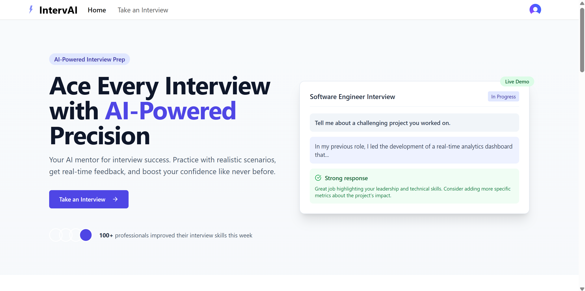

# IntervAI - AI-Powered Mock Interview Platform



[Live Demo](https://interv-ai.vercel.app) - Try IntervAI now and start preparing for your dream job!

IntervAI is an advanced mock interview preparation platform designed to help job seekers practice and improve their interview skills through AI-generated questions and personalized feedback.

## Overview

IntervAI simulates real interview experiences by generating high-quality, role-specific questions and providing detailed feedback on your responses. Our platform helps you build confidence, refine your answers, and master the interview process for any position or industry.

## Features

### 🤖 AI-Generated Interview Questions
- **Role-Specific Questions**: Tailored questions based on the position you're applying for
- **Industry-Relevant Topics**: Questions covering technical skills, soft skills, and industry knowledge
- **Varied Difficulty Levels**: Practice with questions ranging from basic to advanced

### 📊 AI-Assisted Feedback System
- **Comprehensive Response Analysis**: Get detailed feedback on the strengths and weaknesses of your answers
- **Rating System**: Each response is rated on a scale of 1-10 to track your improvement
- **Improvement Suggestions**: Actionable advice to enhance your interview performance

### 🎯 Customizable Interview Experience
- **Create Custom Interviews**: Design your own interview sessions based on specific skills or topics
- **Unlimited Practice**: Practice as many times as you need with no session limits
- **Personalized Question Sets**: Generate questions based on your experience level and job requirements

### 📱 User-Friendly Interface
- **Intuitive Dashboard**: Track your progress and performance over each interview you create
- **Responsive Design**: Access the platform from any device
- **Interview Mode**: Realistic interview simulation with timed responses

### 📚 Learning Resources
- **Expected Answer Examples**: Review high-quality sample answers for each question
- **Industry Insights**: Access tips and tricks specific to your target industry
- **Performance Analytics**: Identify patterns and areas for improvement

## How It Works

1. **Create Your Profile**: Enter your target position, industry, experience level, and skills
2. **Generate Interview**: Fill the details listing the company you wish to interview for, your technical skills and why you want to apply to that company
3. **Practice Interviews**: Answer AI-generated questions in a simulated interview environment
4. **Receive Feedback**: Get instant, detailed feedback and ratings on your responses

## Getting Started

### Prerequisites
- Modern web browser
- Internet connection
- Account registration

### Quick Start
1. Sign up for an account at [IntervAI](https://interv-ai.vercel.app)
2. Complete your profile with relevant job information
3. Create your first mock interview
4. Practice responding to questions and review your feedback
5. Iterate and improve based on AI-assisted recommendations

## Running Locally

To set up and run IntervAI on your local machine:

1. Clone the repository:
   ```bash
   git clone https://github.com/irohitdeshpande/ai-mock-interviewer.git
   cd src
   ```

2. Install dependencies:
   ```bash
   pnpm install
   ```

3. Start the development server:
   ```bash
   pnpm run dev
   ```

4. Access the application:
   - Open your browser and navigate to `http://localhost:5173`
   - For best experience, use *Google Chrome* or open in *incognito mode*

## Use Cases

- **Job Seekers**: Prepare for upcoming interviews with targeted practice
- **Career Changers**: Familiarize yourself with industry-specific questions
- **Students**: Build confidence before entering the job market
- **Professionals**: Refine your interview skills for career advancement
- **Recruiters**: Use as a tool to help candidates prepare for actual interviews

## Technical Highlights

- Built with React, Vite, and TypeScript for a seamless, responsive experience
- Utilized the Gemini API to generate relevant questions and provide meaningful feedback
- Implemented speech-to-text functionality using react-hooks-speech-to-text for hands-free answering
- Secured user authentication and data protection using Clerk
- Cloud-based storage for interview history and performance data on Firebase

## Contributing

Contributions and suggestions to further improve this project are most welcome! If you have ideas or want to contribute:

1. Fork the repository
2. Create a new branch for your feature (`git checkout -b feature/amazing-feature`)
3. Commit your changes (`git commit -m 'Add some amazing feature'`)
4. Push to the branch (`git push origin feature/amazing-feature`)
5. Open a Pull Request

### 🚀 Let's Build IntervAI Together!

IntervAI is just the beginning, and the possibilities are endless! I'm thrilled to collaborate with passionate contributors like you to take this platform to the next level. Got an idea to make IntervAI even more amazing? Let's bring it to life together—your creativity and expertise can make a real difference!

## License

This project is licensed under the MIT License. See the [LICENSE](LICENSE) file for details.